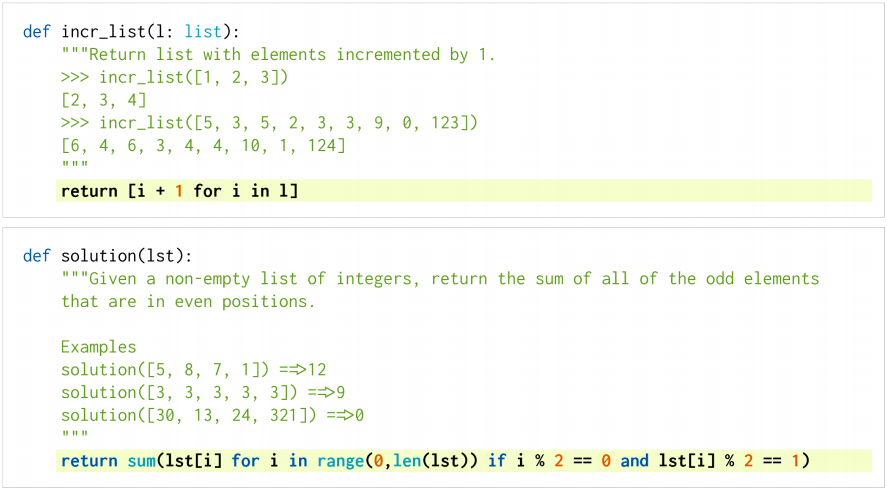
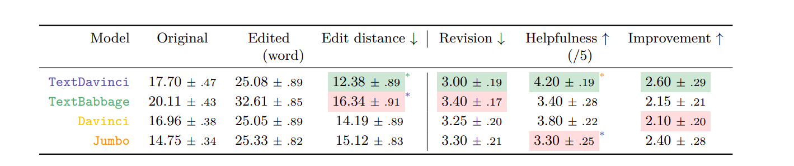
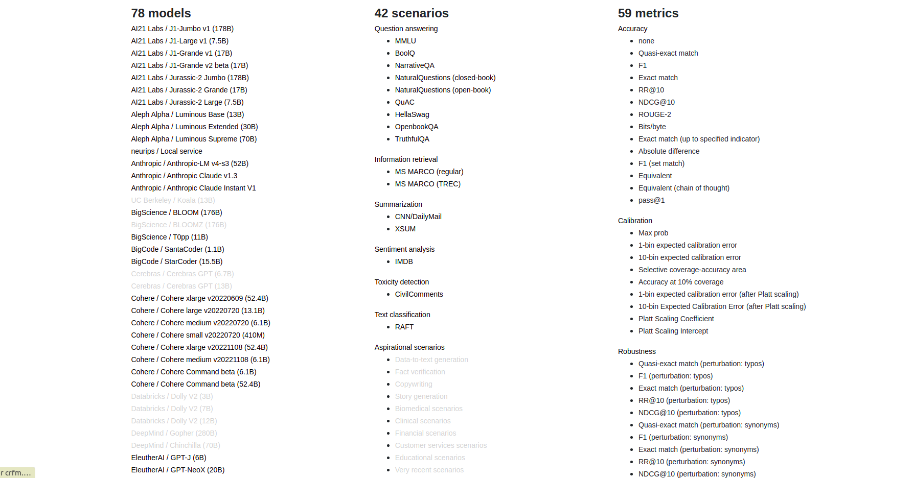
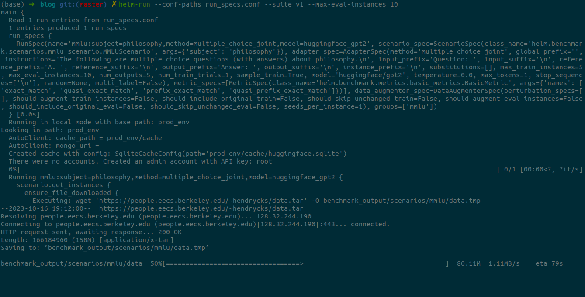
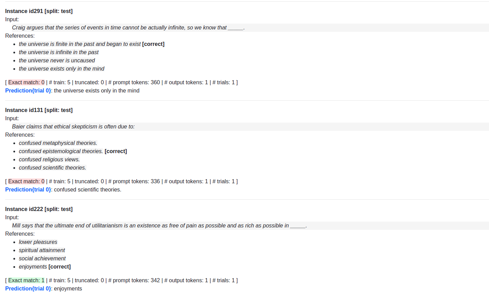
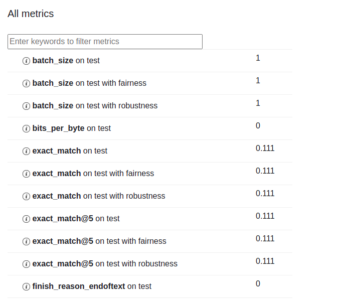

# Why do we need to evaluate LLMs?

It is a well known fact in the LLM world that evaluating large language models is no easy task. It's something that researchers are still trying to perfect even today. For the end user specifically, creating LLM applications that deliver value is of utmost importance and as developers we need to understand how to measure that value. Josh Tobin, an OpenAI researcher, explains that with the advent of generative AI, anyone can create an MVP within 15 minutes. From then on, a lot of people underestimate the amount of effort required to convert that MVP into a full fledged product. Robust evaluation processes are needed to create reliable production ready LLM systems that are much more than just a simple rudimentary prototype.

# Why is it so hard to evaluate LLMs?

The main issue with evaluating LLM outputs or any kind of generative AI output is that there really isn't any kind of "right" or "wrong" answer. Take for example, describing what a Golden Retriever looks like. Objectively yes, there is a baseline requirement for a dog's basic features to be there but an LLM can output two different descriptions of a Golden Retriever which can be accurate. The question here is how would we quantify which of the two descriptions is better? Moreover, with a diverse set of outputs, some cases might be considered right in some scenarios and wrong in others. 

So... what do we do?

# Introducing Benchmarking!

Since the beginning of time, we've evaluated human performance through standardised tests like the SATs or GREs so why can't we employ that for evaluating LLMs? Well, benchmarking does just that.

Benchmarking simply refers to standardised software performance tests. Most language model benchmarks are based on specific NLP tasks from which we can get a numeric result. This is great because it solves the problem of being unable to quantitatively measure qualitative tasks.

There are five main categories to benchmarking:
- Functional Correctness
- Live Human Eval
- Models evaluating models
- Task-specific performance
- Matching human answers

I'll explain each category and a corresponding example.

## Functional Correctness

This benchmark is mostly used for evaluating downstream tasks where we check if the output is actually solving the problem we want it to solve. This covers problems with definite outputs so areas like code completion.
Eg:- `HumanEval`,`StaticEval`

### HumanEval

It is an evaluation dataset containing 164 original programming problems that measure the functional correctness of code. These problems assess language comprehension, algorithms, and simple mathematics, with some
comparable to simple software interview questions. 

Here's what the problems look like:



It is primarily used for evaluating the task of converting detailed docstrings into code popularly done by Codex, a GPT language model finetuned on publicly available code from GitHub, and studying its Python code-writing capabilities. 

It uses a metric called pass@k which is a probability of getting at least one output right out of k samples that a prompt generates. If k = 10, the prompt would be directed to generate 10 samples out of which we will check if any one sample passes the unit tests. So, pass@10 = 0.5 that means 50% of the user prompts generated at least one sample of code that successfully passed unit tests out of the 10 samples generated. 

![List of models with their respective pass@1 metric [in percentage]](passk.png)


## Live Human Eval

This benchmark refers to evaluating LLMs through active human feedback that may translate to a thumbs up/thumbs down to an LLM output or rating an LLM response from 1-5.  Eg:- `Chatbot Arena`,`HALIE`

### HALIE
Human-AI Language-based Interaction Evaluation or HALIE is an evaluation framework that defines the components of human-LM interactive systems and evaluation metrics, putting interaction at the center of LM evaluation.

Interactive evaluation lies at the heart of this framework focusing on interactions between the user and a system. A system consists of a language model (LM), a user interface (UI), and a system logic which constructs prompts and invokes the LM. HALIE formally defines the system logic with states and actions. A state of the system refers to the textual contents in the UI (e.g., dialogue history and the current text in a user input box), and an action is taken by a user (e.g., clicking the “send” button or typing into a text box) through the UI, which subsequently triggers the system to update the state.

The tasks involved in HALIE are 
- Social Dialogue
- Question Answering
- Crossword Puzzle
- Text Summarization
- Metaphor Generation

For this framework, let's dive into the task of `text summarization` in detail.

#### Task
This task involves human-LM interaction for single-document summarization, where users interact with the system to correct LM-generated summaries. Given a document and a model-generated summary, users edit the
summary to be consistent, relevant, and coherent. They randomly selected 964 documents from the XSum dataset and constructed 20 summarization sessions by randomly choosing ten documents per session without replacement.

- `System State` - document, user summary history, user input, and survey questions.
- `System Action` - Responding to the survey questions and clicking the next button after filling in the survey responses.


#### Metrics

To understand the metrics they used to evaluate this task, let's look at a user study.

39 crowd workers (or users) on Amazon Mechanical Turk were recruited. For each model, they collected 20 summarization sessions (80 in total), while allowing the same users to participate multiple times. Upon receiving a model-generated summary for each document, users were asked to edit the summary to be consistent, relevant, and coherent. Users were asked to evaluate the consistency, relevance, and coherence of the original
(model-generated) summary and edited summary before and after editing. At the end of a summarization
session, users completed a survey about their overall experience interacting with the system.

The survey involved the following kinds of questions [The 5-point Likert metric refers to the user choosing one of the five options - Strongly Agree, Agree, Neutral, Disagree, Strongly Disagree]:
- Helpfulness (5-point Likert): How helpful was having access to the AI assistant as an automated summarization tool?
- Edit amount (5-point Likert): How much did you have to edit the generated summaries?
- Improvement (5-point Likert): The AI assistant improved as I edited more summaries.

At the end, here's what the metrics look like



Users edited summaries generated by TextBabbage the most, and TextDavinci the least. Overall, users perceived TextDavinci to be most helpful (helpfulness) and better improves over time (improvement) compared to the other models. The first three metrics refer to the length of model-generated summaries (original), human-edited summaries (edited), and the Levenshtein distance between them (edit distance). The numbers indicate means and standard errors, and the markers denote statistical significance.

To note, Levenshtein distance refers to the smallest number of single-character modifications (insertions, deletions, or substitutions) required to transform one word into the other. For example, the Levenshtein distance between the words `can` and `tap` is 2.

- can --> tan [1 modification]
- tan --> tap [1 modification]

So, if the distance is high, that reflects more inaccuracy between the human edited summary and the model generated summary.


## Models evaluating models

This might be counterintuitive but for certain tasks like language translation and abstractive summarization, LLMs are great at evaluating other LLMs. An LLM is prompted to act like an evaluator and evaluates other model against reference outputs. Eg:-`AlpacaEval`, `GEMBA`

### AlpacaEval

AlpacaEval is an LLM-based automatic evaluation that is fast, cheap, replicable, and validated against 20K human annotations. It is based on the AlpacaEval dataset which contains something like this:

```
  {
    "dataset": "helpful_base",
    "instruction": "What are the names of some famous actors that started their careers on Broadway?",
    "output": "Some famous actors that started their careers on Broadway include: \n1. Hugh Jackman \n2. Meryl Streep \n3. Denzel Washington \n4. Julia Roberts \n5. Christopher Walken \n6. Anthony Rapp \n7. Audra McDonald \n8. Nathan Lane \n9. Sarah Jessica Parker \n10. Lin-Manuel Miranda",
    "generator": "text_davinci_003"
  },
  {
    "dataset": "helpful_base",
    "instruction": "How did US states get their names?",
    "output": "US states get their names from a variety of sources, including Native American tribes, Spanish explorers, British colonists, and even presidents. For example, the state of Alabama was named after the Native American tribe that lived in the area, while the state of Florida gets its name from the Spanish explorer, Ponce de Leon, who explored the area in the 1500s. Other states are named after English kings (like Virginia, named after England's \"Virgin Queen,\" Queen Elizabeth I) or presidents (like Washington, named after George Washington).",
    "generator": "text_davinci_003"
  },
  {
    "dataset": "helpful_base",
    "instruction": "Hi, my sister and her girlfriends want me to play kickball with them. Can you explain how the game is played, so they don't take advantage of me?",
    "output": "Kickball is a game similar to baseball, but with a large rubber ball instead of a bat and a ball. The game is usually played with two teams of six players each. Each team has three bases and a home plate. The players on the kicking team line up at home plate and take turns kicking the ball. The object of the game is to score runs by running around all three bases and back to home plate without being tagged out by the defense. The team with the most runs at the end of the game is the winner.",
    "generator": "text_davinci_003"
  }
```

AlpacaEval outputs a leaderboard containing the performance of the desired model against a reference model (`text-davinci-003`) evaluated by an LLM acting as an automatic evaluator. The following leaderboard contains a list of models with their win rates evaluated by `alpaca_eval_gpt4`.

**`alpaca_eval_gpt4` minimal leaderboard**:

|         Model         | Win Rate | Std Error |
|:----------------------|---------:|----------:|
| gpt4                  |     95.3 |       0.7 |
| claude                |     88.4 |       1.1 |
| chatgpt               |     86.1 |       1.2 |
| wizardlm-13b          |     75.3 |       1.5 |
| guanaco-65b           |     71.8 |       1.6 |
| vicuna-13b            |     70.4 |       1.6 |
| oasst-rlhf-llama-33b  |     66.5 |       1.7 |
| text_davinci_003      |     50.0 |       0.0 |
| falcon-40b-instruct   |     45.7 |       1.8 |
| alpaca-farm-ppo-human |     41.2 |       1.7 |
| alpaca-7b             |     26.5 |       1.5 |
| text_davinci_001      |     15.2 |       1.2 |

The win rate measures the fraction of time the model's output is preferred over text-davinci-003 outputs ( i.e. the reference). More specifically, to compute the win rate they collected pairs of outputs of the desired model on every instruction from the AlpacaEval dataset. They then pair each output with the output of the reference model (text-davinci-003) on the same instruction and ask the automatic evaluator which output it prefers.

The `alpaca_eval_gpt4` annotator averages over preferences, where preferences are obtained as follows:

- it takes in an instruction and a pair of outputs (from the desired model and the reference model)
- if a preference was already computed, it returns it (i.e. it uses caching)
- it randomizes the order of the outputs to avoid position bias
- it formats the instruction and outputs into the following zero-shot prompt, which asks to order the outputs in order of preference
- it completes the prompt using GPT4 with temperature=0
- it parses the preference from the completions and returns it

The `alpaca_eval_gpt4` is prompted to act like an evaluator and its effectiveness is measured by comparing it to 2.5k human annotations which look like this:

```
  {
    "instruction":"The sentence you are given might be too wordy, complicated, or unclear. Rewrite the sentence and make your writing clearer by keeping it concise. Whenever possible, break complex sentences into multiple sentences and eliminate unnecessary words.\n\nIf you have any questions about my rate or if you find it necessary to increase or decrease the scope for this project, please let me know.",
    "output_1":"If you have questions about my rate or need to modify the scope of this project, please let me know.",
    "output_2":"If you have any questions about my rate or need to adjust the scope for this project, please let me know.",
    "preference":1,
    "annotator_index":15,
    "dataset":"selfinstruct",
    "datasplit":"eval"
  }
```
The following metrics are used to measure evaluators:

|                         | Human agreement [%] | Price [$/1000 examples] | Time [seconds/1000 examples] |Bias | Variance | Proba. prefer longer |
|:------------------------|--------------------:|------------------------:|-----------------------------:|-----:|---------:|--------------------:|
| alpaca_eval_gpt4_fn     |                71.0 |                    14.5 |                         5046 | 27.6 |     11.1 |  0.75 |
| alpaca_eval_gpt4        |                69.2 |                    13.6 |                         1455 | 28.4 |     14.6 |                 0.68 |
| aviary_gpt4             |                69.1 |                    12.8 |                         1869 | 29.5 |     13.1 |                 0.70 |
| gpt4                    |                66.9 |                    12.5 |                         1037 | 31.5 |     14.6 |                 0.65 |
| alpaca_farm_greedy_gpt4 |                66.4 |                    15.3 |                          878 | 30.2 |     19.3 |                 0.60 |
| humans                  |                65.7 |                   300.0 |                        36800 |  0.0 |     34.3 |                 0.64 |
| claude                  |                65.5 |                    11.1 |                          173 | 31.9 |     18.0 |                 0.62 |
| text_davinci_003        |                64.1 |                     8.7 |                          121 | 33.8 |     22.7 |                 0.70 |
| lmsys_gpt4              |                63.2 |                    13.9 |                        17982 | 34.7 |     16.1 |                 0.74 |
| chatgpt_fn              |                60.0 |                     1.0 |                          530 | 36.9 |     27.7 |                 0.62 |
| chatgpt                 |                57.2 |                     0.8 |                          285 | 39.4 |     34.1 |                 0.59 |

- Human Agreement - This measures the agreement between the current annotator and the majority preferences of humans on the ~650 annotations from the cross-annotation set, which contains 4 human annotations per example. To estimate the agreement between a single human (humans row in the table above) and the majority of humans, we take one of the 4 annotations and compute the accuracy that it has when predicting the mode of the other 3 annotations. We then average this accuracy over all 4 annotations and over the 650 instructions to get the human agreement.
- Price - This is the average price of every 1000 annotations. 
- Time - This is the average time it takes to compute 1000 annotations i.e. the average time that it took when running the annotations.
- Bias - Agreement between the most likely human label and the most likely automatic one. A low bias means that the annotator has in expectation the same preferences as humans. For the case of humans, the bias is zero by definition.
- Variance - Expected agreement a single automatic preference and the most likely one. A low variance means that the annotator is consistent with its preference, i.e., if you sample from it with different seeds it will give the same result.


## Task specific performance 

Benchmarks that test the LLM output through a particular task or scenario like question answering, metaphor generation or summarization. Eg:- `HeLM`, `MMLU`, `SuperGlue`

### HeLM
Holistic Evaluation of Language Models or HeLM is a benchmark that evaluates prominent language models across a wide range of scenarios from question answering to summarization to toxicity detection. It has three main features:

1. **Broad coverage and recognition of incompleteness** - Given language models’ vast surface of capabilities and risks, we need to evaluate language models over a broad range of scenarios. However, it is not possible to consider all the scenarios, so holistic evaluation should make explicit all the major scenarios and metrics that are missing.
2. **Multi-metric measurement** - Most existing benchmarks consider scenarios with a single main metric (usually accuracy), relegating the evaluation of other desiderata (e.g., toxicity) to separate scenarios. Holistic evaluation should represent these plural desiderata. 
3. **Standardization** - The object of evaluation is the language model, not a scenario-specific system. Therefore, in order to meaningfully compare different LMs, the strategy for adapting an LM to a scenario should be controlled for. Further, we should evaluate all the major LMs on the same scenarios to the extent possible.



The above image contains information (you can click on the word you want to know more about) about every model, scenario and metric that HeLM uses to evaluate an LLM. 

For example, let's take a question answering scenario which uses the MMLU benchmark to evaluate the gpt-2 model.
To note, the MMLU or Massive Multitask Language Understanding is a benchmark for knowledge-intensive question answering across 57 domains like science, philosophy etc.

We first create a run_specs.conf file which includes information about the kind of benchmark we want to use, domain and model we want to evaluate.

```
echo 'entries: [{description: "mmlu:subject=philosophy,model=huggingface/gpt2", priority: 1}]' > run_specs.conf
```

Then, we run HeLM on that benchmark on 10 instances and summarise those results.
```
helm-run --conf-paths run_specs.conf --suite v1 --max-eval-instances 10
helm-summarize --suite v1
```


We start a web server to view the eval results.

```
helm-server
```




As you can see, the model was able to answer one of the questions correctly but answered most of them wrong with the exact_match metric being 0.111 

## Matching human answers

The basic way to evaluate LLMs is to compare the LLM generated output with a human generated output which benchmarks like BLEU and ROUGE does.

### BLEU
Bilingual Evaluation Understudy or BLEU is a metric used to evaluate the quality of machine-generated translations against one or more reference translations. It measures the similarity between the machine-generated translation and the reference translations based on the n-grams (contiguous sequences of n words) present in both. A higher BLEU score indicates more overlap between the generated and reference translations.

```
from collections import Counter
import nltk.translate.bleu_score as bleu
 
 
def calculate_BLEU(generated_summary, reference_summary, n):
    # Tokenize the generated summary and reference summary
    generated_tokens = generated_summary.split()
    reference_tokens = reference_summary.split()
 
    # Calculate the BLEU score
    weights = [1.0 / n] * n  # Weights for n-gram precision calculation
    bleu_score = bleu.sentence_bleu([reference_tokens], generated_tokens, weights=weights)
 
    return bleu_score
 
 
# Example usage
generated_summary = "The dog slept on the couch."
reference_summary = "The cat sat on the mat."
n = 2  # Bigram
 
bleu_score = calculate_BLEU(generated_summary, reference_summary, n)
print(f"BLEU-{n} score: {bleu_score}")
```
The output is 0.37 indicating that there isn't too much similarity between both sentences. 

However, BLEU has its disadvantages. An incorrect translation can still recieve a high score. For example, if we take the following two summaries:

- generated_summary = "The dog slept on the couch."
- reference_summary = "The The The The The"

This will give be a perfect score of 1, since the word "The" exists in both summaries even though it isn't a correct translation. Additionally, BLEU cannot evaluate the importance of errors. For a BLEU score, an error is just that: an error. In real life, if a word is placed incorrectly within a sentence, it can change its entire meaning. A very low score does generally reliably indicate that a translation is of poor quality, but a high score can also simply be the result of an error in the system.

Hence, the best scenario to use BLEU is to answer the question, "Is our current system better than the old one?"

# References

- https://arxiv.org/pdf/2212.09746.pdf
- https://crfm.stanford.edu/2022/11/17/helm.html
- https://github.com/tatsu-lab/alpaca_eval/tree/main
- https://crfm-helm.readthedocs.io/en/latest/quick_start/
- https://deepgram.com/learn/humaneval-llm-benchmark
- https://deepgram.com/learn/mmlu-llm-benchmark-guide