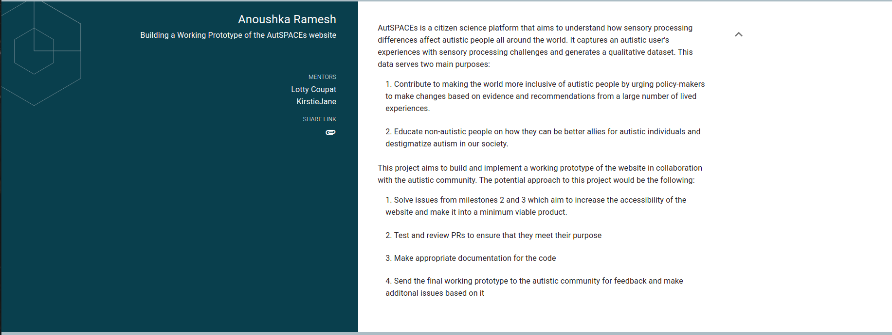
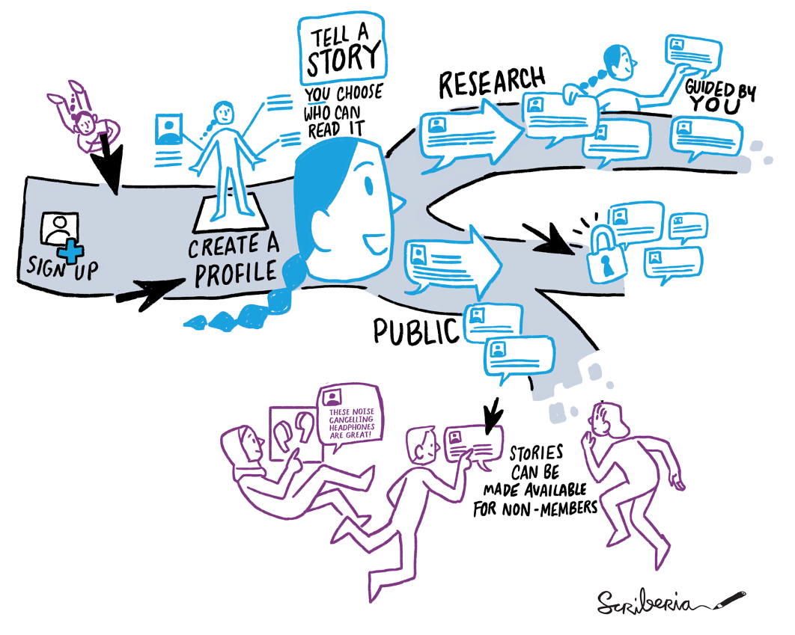

### 
 *GSoC 2021: Congratulations, your proposal with INCF has been accepted!* 

 
I honestly couldn’t believe it. Till 11:17 PM that day, I was ridden with anxiety but it was all worth it when I finally saw the awaited email. Hours spent in proposal writing, maintaining constant communication with the project leads and handling ongoing uncertainties until now finally paid off. 

The 2 month long project involves building a working prototype of AutSPACEs - a citizen science, participatory platform for, with and by the autistic community. It aims to capture their experiences with sensory processing difficulties. It sends this information to scientists who can generate better datasets and urge policy-makers to design and adapt spaces better suited to an autistic person’s needs. (Hence the name, AutSPACEs)

The thing is, autism can’t be clearly categorised into separate levels. It’s different for everyone. That’s why making any advancements in this realm prove to be so difficult considering every individual has different needs and requirements. So, AutSPACEs reaches out to these autistic users to get information that is raw, authentic and true to each individual which scientists can rely on to get the best possible outcomes.

AutSPACEs is developed using Python over a Django framework. It is connected to a backend database called Open Humans which is responsible for storing all the user experiences. Essentially, this database will be accessed through API calls where each user’s information will be stored as JSON data in a file. For the frontend, Bootstrap is being implemented to design the web pages with reference to simplified wireframes. The project has a lot of focus on the UI aspects as well because certain colours and layouts tend to trigger an autistic person’s senses. Hence, making the site as accessible as possible is a priority.

The project is currently in its early stages with the immediate goal of creating an MVP or minimum viable product of the site. I’m really looking forward to helping the team achieve this!

My Google Summer of Code journey took off with the community bonding period. Right after my first interaction with my mentors, Kirstie Whitaker and Lotty Coupat, and the autistic community along with project lead, Georgia Aitkenhead and head developer, James Kim, I was absolutely delighted to be a part of this amazing team. The meetups and the community calls provide a really lively atmosphere to share ideas and collaborate with the moderators and the dev team to reach viable solutions. 

I can’t wait to see what’s in store for me in the next two months. To infinity and beyond!

