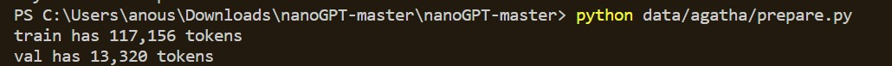
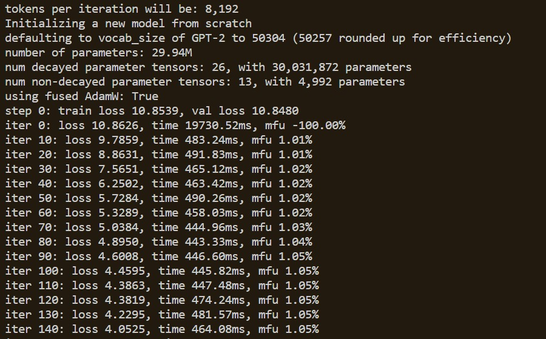
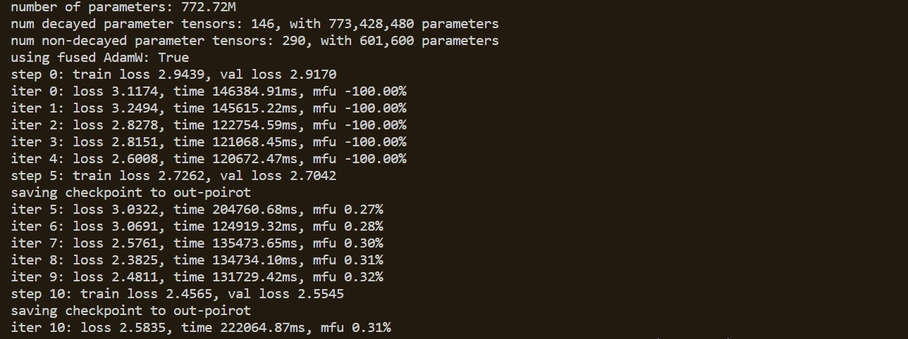
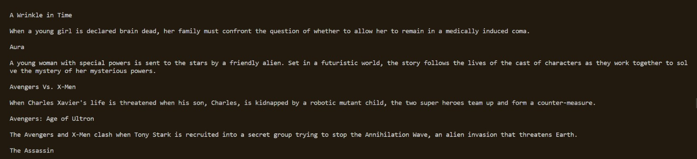

Employing LLMs to do what we want is now possible through prompting and finetuning. For specific downstream tasks, we can finetune the LLM on our own custom dataset to generate the outputs that we want. However, finetuning is computationally expensive requiring GPUs to train these LLMs so most of the times, we can't fientune LLMs using just our computer. 

Andrej Karpathy from OpenAI created a simple framework called nanoGPT that enables you to train and finetune medium sized GPTs. It gives you an interesting insight into how a GPT works and allows you to use your custom dataset to train these models. His [video](https://www.youtube.com/watch?v=kCc8FmEb1nY&t=2265s) on building a GPT from scratch, breaks down the concepts of a GPT's architecture and what really goes on under the hood. 

Being an avid fan of Agatha Christie's Hercule Poirot mystery series, I decided to train and finetune a GPT to generating text that somewhat resembles her writing and enjoy reading a never seen before mystery story in the hand of Agatha Christie!


# Training

There are three stages to producing a piece of text through training a GPT on your dataset in nanoGPT
- Prepare
- Train
- Sample

## Prepare

This stage involves loading your dataset (in this case, a text file) and creating tokens through the OpenAI BPE tokeniser called tiktoken. For the dataset, I used Agatha Christie's Poirot Investigates book which is a series of 8 short murder mystery stories. 

I initially thought of getting one of her novels which contained one mystery and inputting that into the model directly for training however, that didn't work out so well. Choosing a list of short stories which contains a mystery from start to end would give the model several examples of her writing in a short dataset which would be more feasible than working with several novels for our experiment.

For every new dataset, we need to create a prepare.py file which ultimately divides the tokens into training(train.bin) and validation (val.bin) data. I stored the file under a folder called `agatha` in the `data` folder.

```
import os
import requests
import tiktoken
import numpy as np

input_file_path = os.path.join(os.path.dirname(_file_), 'poirot.txt')
with open(input_file_path, 'r') as f:
    data = f.read()
n = len(data)
train_data = data[:int(n*0.9)]
val_data = data[int(n*0.9):]

# encode with tiktoken gpt2 bpe
enc = tiktoken.get_encoding("gpt2")
train_ids = enc.encode_ordinary(train_data)
val_ids = enc.encode_ordinary(val_data)
print(f"train has {len(train_ids):,} tokens")
print(f"val has {len(val_ids):,} tokens")

# export to bin files
train_ids = np.array(train_ids, dtype=np.uint16)
val_ids = np.array(val_ids, dtype=np.uint16)
train_ids.tofile(os.path.join(os.path.dirname(_file_), 'train.bin'))
val_ids.tofile(os.path.join(os.path.dirname(_file_), 'val.bin'))
```

To run the prepare.py file, run this command.
```
python data/agatha/prepare.py
```
You should get something like this after running the command



## Train

Next, we train the model on the training data by running this command.

```
python train.py config/train_poirot.py
```

So, as you can see there are two files in question here - the train.py and train_poirot.py files.

The train.py file defines a set of parameters and the code dependent on the kind of device (cpu, cuda, mps etc.) you're using. For this experiment, I used a single NVIDIA GPU to run around 5000 iterations for training the model. The training process involves the following steps:
1. Fetch the first batch of data (batch_size = 32) 
2. Set the learning rate
3. Evaluate loss
4. Capture checkpoints which is done everytime the loss decreases
5. Perform a forward backward pass (update the model)

The train_poirot.py file is a neat way to store all the parameters that are set to your custom values that override the default values in train.py. Here's what the main parameters mean:
- `gradient_accumulation_steps` - This is the number of batches after which a gradient update should happen.
- `batch_size` - This refers to the number of data samples processed in one forward pass
- `block_size` - This refers to the context length. The longer the context length, the more computationally expensive it will get.
- `n_layer` - The number of layers in the model, more the layers more complex is your model
- `n_head` - The number of attention heads in the multi-layer attention part of the transformer
- `n_embd` - The dimensionality of embedding vectors, higher the value, higher the complexity
- `dropout` - Helps prevent overfitting by setting a number of inputs to zero. So, a dropout value of 0.2 refers to 20% of the input values being zero.
- `learning rate` - Step-size at which model's parameters are updated
- `max_iters` - Maximum number of iterations which the model is trained on


```
out_dir = 'out-poirot'
eval_interval = 250 # keep frequent because we'll overfit
eval_iters = 200
log_interval = 10 # don't print too too often

# we expect to overfit on this small dataset, so only save when val improves
always_save_checkpoint = False

wandb_log = False # override via command line if you like
wandb_project = 'agatha'
wandb_run_name = 'mini-gpt'

dataset = 'agatha'
gradient_accumulation_steps = 1
batch_size = 32
block_size = 256 # context of up to 256 previous characters

# baby GPT model :)
n_layer = 6
n_head = 6
n_embd = 384
dropout = 0.2

learning_rate = 1e-3 # with baby networks can afford to go a bit higher
max_iters = 5000
lr_decay_iters = 5000 # make equal to max_iters usually
min_lr = 1e-4 # learning_rate / 10 usually
beta2 = 0.99 # make a bit bigger because number of tokens per iter is small

warmup_iters = 100 # not super necessary potentially
```
This is how the training process looks like. `mfu` stands for Memory Footprint Utilisation which indicates the amount of memory used for each iteration of the training process as a percentage.



## Sample

This stage involves generating the text after the model has been trained. The file also conatins majority of the code defined in train.py except for the following piece of code. It refers to the checkpoint contained in `out-poirot` to generate text.

```
# encode the beginning of the prompt
if start.startswith('FILE:'):
    with open(start[5:], 'r', encoding='utf-8') as f:
        start = f.read()
start_ids = encode(start)
x = (torch.tensor(start_ids, dtype=torch.long, device=device)[None, ...])

# run generation
with torch.no_grad():
    with ctx:
        for k in range(num_samples):
            y = model.generate(x, max_new_tokens, temperature=temperature, top_k=top_k)
            print(decode(y[0].tolist()))
            print('---------------')
```

To generate text, run this command.
```
python sample.py --out_dir=out-poirot
```

Annddd this is the output

```
'And that I'd got to have been
belant is that I should be really to hurry over, Hastings, but he was no. I am
have the mysterious man, my friend.'

The little bottle to take a lady's nurse, and the stairs. He is no further supply into the disaster. In a

'I didn't it wasps'But I ami. It's death, eh, I was likely to scorn, Lady Juliet
your mind. She was a little husband's a moment! But they feel
partly and
not yet my little affair on the garden, you reply. She, but I was a sharp face wasps— and her husband, the window.
evening, however, madame, you know that she
friend, Monsieurier's eight, but no time, there was
on one, I knew that she slipped to be tired. He is the paper for your time, though she had
never just for you say, the smoking-five and a moustache. I knew
window, did not be the boy to see her, and left the library.

to see, Poirot. He
But it somewhere.'
'I know this evening.'
```
It doesn't make a lot of sense but the words themselves sort of resemble her writing?    

Let's try to do better with finetuning.  


# Finetuning

The process for finetuning remains the same except this time we refer to a different set of parameters defined in `finetune_poirot.py`. In this file, we load an existing pretrained model (gpt2-large - 776 million params!)
and finetune that to our usecase.

```
import time

out_dir = 'out-poirot'
eval_interval = 5
eval_iters = 40
wandb_log = False # feel free to turn on
wandb_project = 'agatha'
wandb_run_name = 'ft-' + str(time.time())

dataset = 'agatha'
init_from = 'gpt2-large' # this is the largest GPT-2 model

# only save checkpoints if the validation loss improves
always_save_checkpoint = False

batch_size = 1
gradient_accumulation_steps = 32
max_iters = 10

# finetune at constant LR
learning_rate = 3e-5
decay_lr = False
```

To run this file, we use the following command.
```
python train.py config/finetune_poirot.py
```
This took a lot longer than expected and I managed to get 10 iterations out of it




Next, we define a prompt.txt file which is converted to embeddings in the sample.py file. Initially, I used the following prompt - In the style of Agatha Christie, craft a short story where an unexpected guest at a remote country estate dinner party ends up murdered, leaving the guests to unravel the secrets and motives hidden among them.

It got me some pretty silly results



So, I tweaked the prompt so that the model generates text that continues the story. The prompt starts like this-

```
Title: "The Enigmatic Garden Murder"

In the sleepy village of Willowbrook, nestled amidst rolling hills and lush greenery, 
a group of friends gather for their annual garden party. 
Lady Margaret Hastings, the elegant hostess known for her exquisite rose garden, 
has invited her closest friends and neighbors to revel in the beauty of her estate.        

As the afternoon sun bathes the garden in a warm, golden glow,
```

And after waiting patiently for 30 mins as the model generated the sample, we get this

```
Title: "The Enigmatic Garden Murder"

In the sleepy village of Willowbrook, nestled amidst rolling hills and lush greenery, 
a group of friends gather for their annual garden party. 
Lady Margaret Hastings, the elegant hostess known for her exquisite rose garden, 
has invited her closest friends and neighbors to revel in the beauty of her estate.        

As the afternoon sun bathes the garden in a warm, golden glow, 
a small, young man arrives in a beige chauffeur's car and picks up a young woman from the carousel. 
He smiles broadly and informs her that the afternoon's guests are all her relatives. 
They are not the sort of people she is used to seeing, however, and they demand to know where she is going. 
The young man reluctantly responds that she is going to the cottage of the Duke of Douglas.

The Duchess appears with her husband at once, but when the young man insists on taking his leave, 
she hesitates. Despite her chagrin, she gives him the keys to the cottage and asks him to escort her out.

Murdered: A Girl Who Loved the Water

The young man emerges from the cottage in a raincoat and comes out into the alleyway with his mistress. 
They approach each other.

"I should like to ask you something," he says. "You're going to the cottage of the Duke of Douglas?"

"Yes, I am."

"But what is the purpose for your visit?"

"I want to find out more about the painting in the house. It was a gift from a friend of mine. 
He did not appreciate the painting quite as I do."

"He very nearly had it," replied the maid. "He had an obstinate and irritable temper."

"But how could he have done it?" asked the young man anxiously.

Dowager Margaret Hastings took a deep breath. "Well, he said it was too big and too much of a pain to 
take to get rid of it. He thought it too much like a picture that belonged to his parents. 
He said he would prefer to have it cleaned up. So he finally decided to destroy it."

"Is that all?" inquired the maid, incredulously. "But how?"

"Oh, it's not so terrible," replied Margaret Hastings with a smile. 
"It just took so long for him to kill the painting, and he was an old hand at that time, 
so he got in a little bit of trouble and had to meet with a certain fate."

"You mean, he got caught up in it?" asked the maid. 
"Surely you didn't mean to kill him in the first place, did you? 
Why would you do such a thing?"

"Miss Bates, I was merely trying to amuse myself; you see, when the painting was at my disposal, 
I took it out and examined it closely, and I thought there was no danger to life or limb. 
But, as I said, the Duke of Douglas has a temper, and, as a result, he was very angry. 
Of course he pushed me aside and, when I tried to get away, he caught me up."

"That's all right, my dear lady. You don't see any danger in it?"

"No, my dear Bates; it was simply a natural, even amusing thing that occurred. I didn't blame him for it. 
His temper was like mine. It's all right to be angry sometimes, and sometimes one is. 
In this case, it seems to me that he was quite justified. I had a pretty good instinct about such things; 
I knew the Duke of Douglas personally, and, of course, he was no friend of mine. He was a good man, 
a sensible man, and he knew he was not to blame for what had happened."

Douglas personally, and, of course, he was no friend of mine. 
He was a good man, a sensible man, and he knew he was not to blame for what had happened."

"And it was, indeed, your husband who had fallen into the trap?" asked the maid. 
"Did you say that he had fallen into the trap?"

"Not the trap myself, Miss Bates. But the Duke of Douglas has the right to dispose of the painting."

"But why?" asked the maid in surprise. "Doesn't he have the right to dispose of the painting?"

"Yes; he did have the right to dispose of it," said Margaret Hastings with a gentle smile. 
"There are rules governing this matter, Miss Bates; one must be content if one 
possesses no means of disposing of a work of art because it is his--and somebody else's--property. 
There are no grounds for anger in this matter." The maid began to tremble. 
"Oh, my God!" she cried. "You're quite right! I have never erred in my life. 
I really believe the Duke of Douglas is guilty of murder!"

The maid's despair was quickly quelled. "I think," said Margaret Hastings, 
"that your husband may have been justified. I really do. 
But that is the trouble: the Duke of Douglas has no right to dispose of the painting 
unless he has the right to dispose of it."

"But what of, Miss Bates?"
```

This output is much much better and it actually does resemble her writing a lot even though it lacks overall structure to the story. For 10 iterations of finetuning, this isn't bad at all. We can perhaps make this better by increasing the number of iterations in training or increasing batch_size but it might be a bit more computationally expensive to do so. Overall, it was a nice experiment and an interesting introduction to training and finetuning models.