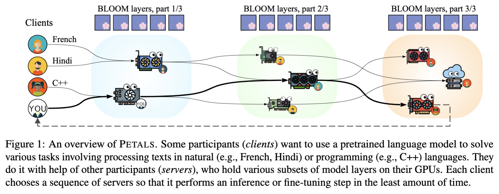
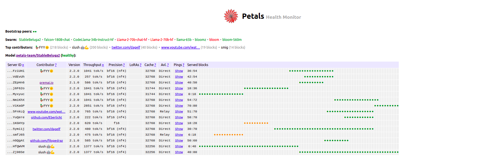
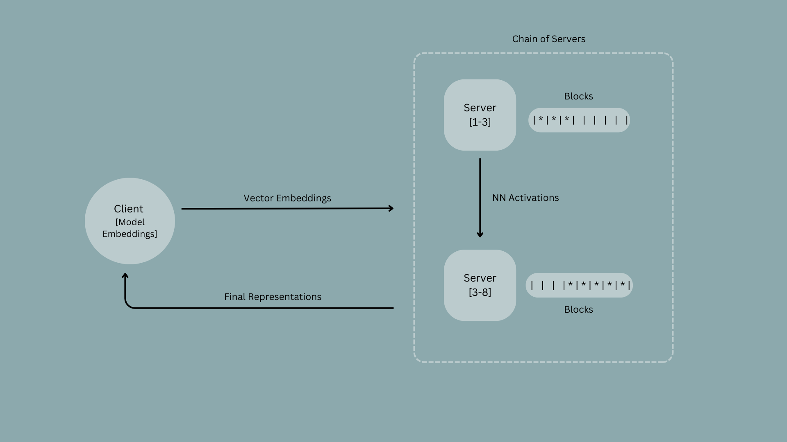
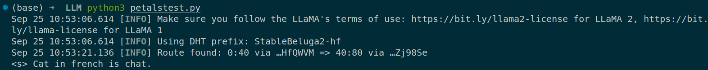

Large Language Models or LLMs are all the hype nowadays with ChatGPT now being a part of our everyday lives. Naturally, the curious lot of us would like to understand how these LLMs work under the hood and run these models ourselves. To effectively run an LLM, we would need numerous GPU servers to handle the load of inference and model training making it computationally expensive to do so. 

But how expensive are we talking about here? For training models in particular, one of the fastest GPUs used is the A100 GPU. For reference, a single A100 GPU costs around $15,000. The Galactica model by Meta AI used 128 A100 GPUs for training. Along with high-end GPUs, it needs equally efficient CPUs. So, NVIDIA offers the DGX A100 which contains CPU compute power and 8 A100 GPUs which racks up to around $200,000. If we do the math, the total cost to fully train an LLM is a whopping $3.2 million. A little out of my price range if you ask me.

The more feasible way to access LLM capabiities is through APIs like the OpenAI API or online platforms that have these models deployed and open for public use. However, a new open source tool called Petals opens the possibility of running these models in your own computer right in the comfort of your home.

# What is it exactly?
Petals is an open source tool created by the [BigScience](https://techcrunch.com/tag/bigscience/) community backed by startup, Hugging Face. This novel tool allows you to run an LLM in your own system through shared GPU servers hosted across the world on other machines. (These servers are contributed by people who offer their system's GPU for use.) You download a small part of the model on your machine while the other servers run other parts of the model for inference and fine-tuning. Think Bit-Torrent for LLMs. 

This novel approach proves to be 10x faster than offloading (processes on a central server divided over multiple servers to increase speed and efficiency of the task) bringing about a more collaborative environment to train LLMs. Petals seeks to incentivise the process of contributing your system GPU where donators will receive “Bloom points” that they can spend on “higher priority or increased security guarantees” or potentially exchange for other rewards.



# What makes it so novel?
The popular method to running LLMs before was offloading. Here's how lead Petals [developer](https://news.ycombinator.com/item?id=34216213), Alexander Borzunov described offloading - "Imagine you have an A100 GPU with 80 GB memory and want to generate text with BLOOM, a 70-block transformer model with ~2.5 GB of weights per block. For each token, offloading will load the first 1/3 of the model (~27 blocks) from RAM/SSD to your GPU memory, run a forward pass through them, then free the memory and load the next 2/3, and so on."

As opposed to APIs, offloading provided a lot of control to the internal weights of the LLM which is great for researchers however, due to the data transfer (we're talking about transfering the model weights here, so around 175 GB transferred to a GPU in three intervals just to generate one token!) from RAM to GPUs, it leads to pretty high latency. This is particularly not favourable for applications like chatbots that need quick responses and rely on low-latency mechanisms. 

Petals is able to do inference 10x faster than offloading because it passes the neural network activation values (intermediate values or outputs produced at each layer of a neural network during the forward pass that represent the model's internal representations) rather than all the weights. This results in a much lower latency value which is perfect for building LLM applications. (Something to also note is that Petals does have a lower throughput than offloading)

# How does it work?

Petals works as a decentralised pipeline where a model is split into different blocks (transformer blocks) and hosted on different GPU servers. Each server holds consecutive blocks, the number of which depends on the server's available GPU memory.



Output generation always takes place in an inference session. Before each inference session, the client is routed through a chain of servers that collectively holds models layers. Each server selects the most optimal set of blocks based on the current bottlenecks within the pipeline. 

In the inference session, the client stores a model's embeddings locally. It then searches embedding vectors on the prefix token of the query from the local embeddings and sends these vectors to the servers. The servers compute these vectors and the final block sends the model representations (neural network activation values) back to the client which then computes probabilities of the next token based on these representations. While the session is active, servers store attention keys and values from past client inputs and use them for subsequent inference steps. To address potential failures, a client stores intermediate activations sent to each block and reroutes them from an offline server to an online node hosting the same block.



# How do you run it on your computer?

It's pretty simple to run Petals on your system. All you need to do is first install Petals

```
pip install git+https://github.com/bigscience-workshop/petals
```
and then run the following code with your preferred open source LLM - this uses Stable Beluga 2 which a finetuned model of LLaMa 2. 

```
from transformers import AutoTokenizer
from petals import AutoDistributedModelForCausalLM

# Choose any model available at https://health.petals.dev
model_name = "petals-team/StableBeluga2"

# Connect to a distributed network hosting model layers
tokenizer = AutoTokenizer.from_pretrained(model_name)
model = AutoDistributedModelForCausalLM.from_pretrained(model_name)

# Run the model as if it were on your computer
inputs = tokenizer("Cat in french is", return_tensors="pt")["input_ids"]
outputs = model.generate(inputs, max_new_tokens=100)
print(tokenizer.decode(outputs[0])) 
```

After running the code, you should get something like this. At the end, we can see the output, "Cat in french is chat."



The line with `Route found: 0:40 via ...` shows that blocks 0 to 40 belong to a GPU server with id ending with HfQWVM and blocks 40 to 80 belong to another GPU server with id ending with Zj98Se. We can see these servers on the Petals health monitor as well. The prompt, "Cat in french is" got converted into embedding vectors which ran through these blocks and gave the final outcome as "Cat in french is chat."

One thing to note is that it does take some time to generate the output from around 15-20 secs to well over a minute depending on the number of the max tokens and the complexity of the prompt. I'd say the main advantage that Petals offers over ChatGPT is that it's free and you get more control over the model's internal states to which different adapters can be fitted to finetune the model.

A pressing question that may come up is how secure even is this thing? In theory, the inputs of the model that someone else has given could be accessed through the intermediate states between blocks. Additionally, these servers belong to other people who potentially could have access to private data sent as input to the model for it be computed on these servers. To address these issue, Petals has recommended organisations to build private swarms containing GPUs by people that they trust so that their data isn't compromised. 

In conclusion, I think Petals is great first step to decentralised compute for training LLMs. It opens a door of opportunities for those who can't afford expensive GPUs to run these models which was earlier only restricted to rich corporations with the wherewithal to do so. I'm definitely excited to see what's more to come.


